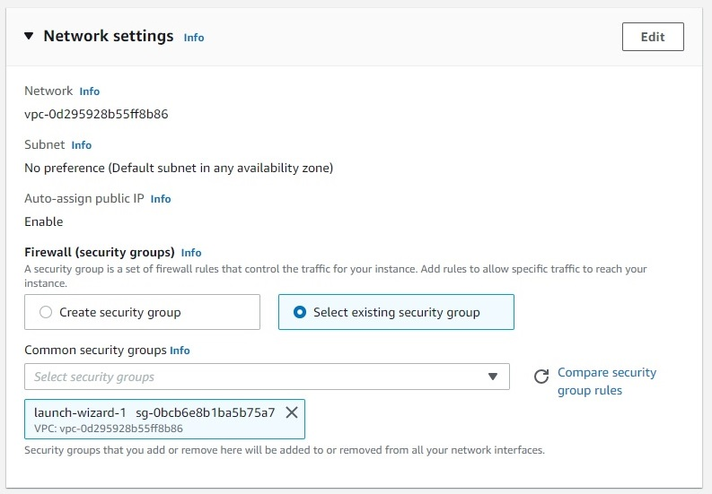
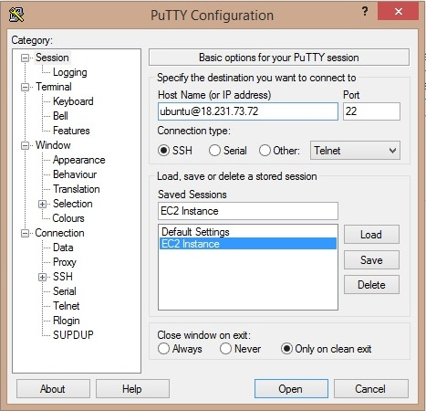

## End-to-end machine learning
*The development of this project goes from a reproduction of business or technological discussions to a deployment as realistic as possible of an analytical solution developed using machine learning. Data used refers to mobile applications and their status about being malware or not. Main technologies used to develop the solution are Python, FastAPI, Docker and AWS. After several rounds of experimentation, it was constructed a binary classification model based upon LightGBM, which has a ROC-AUC of 0.92 and an accuracy rate of 0.84, both evaluated on test data. This document has the following sections: **data and machine learning product**, giving more context to the project, list of **technologies** used, **methodology** of project development, **constructed model** and its expected performance, presentation of **deployment** structure and how it was implemented, and a final section of **backlog**.*

This project has the purpose of integrating different aspects of a machine learning system, so it consists of an **end-to-end machine learning project**. Its **objectives** can be summarized as follows:
* Integrate different study fields.
* Apply several distinct technologies.
* Improve project management skills.
* Implement a deployment solution as realistic as possible.
* More concretely, *develop a complete data product (model + API) that could constitute a mobile app whose goal will be discussed next*.

Having these objectives in mind, the following **assumptions** were raised:
* Does not optimize model performance as it would in a business scenario.
* Does not take into account operational metrics. *Business discussion is not part of the project, thus putting the focus on methodological and technological issues*.
* Given the absence of creation/registry date for each obseration in the dataset, it was assumed that data is independent over time.

### Data and machine learning product
The dataset used to develop this project was found in [Kaggle](https://www.kaggle.com/datasets/saurabhshahane/android-permission-dataset) and it has 184 columns that are attributes for the 27310 rows, each consisting of a single mobile app. The **target variable** is binary and takes value 1 if the app is a malware and 0 otherwise. All remaining columns are potential features, some of which give summary descriptions of the app (price, category, rating), while others indicate actions performed by the app or interactions between the app and the operating system.

Given the binary target variable, the data science problem demanding the development of an analytical solution consists of a supervised learning task of **binary classification**. In order to motivate the construction of a complete solution from *end-to-end*, involving not only a trained machine learning model, but also a deployment as realistic as possible, we can imagine the following situation from the dataset available:

<i>

We want to develop a mobile application that, once installed on a device, should provide information regarding the safety of whatever mobile app that would be installed thereafter.

</i>

 

Therefore, the project wants to create a *machine learning product* which is an **app**, composed of a **model** that calculates the risk of a mobile app being a malware, and an **API** that could be integrated with an app store and with the user by sending him/her a warning message when the mobile app that is about to be downloaded is too risky.

### Technologies
Up to now, the project has demanded working with several distinct technologies, whose use can help with any machine learning, or more generally, data science project. Most of these technologies rely on [Python](https://www.python.org/) programming language, but it's quite likely that there exist substitutes to them for different languages. Below, the most important technologies used in this project are listed and organized according to their purposes.

|       **Task**      |                    **Technology**                    |
|:-------------------:|:----------------------------------------------------:|
| Data management     | [pandas](https://pandas.pydata.org/docs/)  [numpy](https://numpy.org/doc/)                                     |
| Machine learning    | [scikit-learn](https://scikit-learn.org/)  [LightGBM](https://lightgbm.readthedocs.io/)  [XGBoost](https://xgboost.readthedocs.io/)  [scipy](https://docs.scipy.org/doc/scipy/)      |
| Deployment          | [FastAPI](https://fastapi.tiangolo.com/)  [Docker](https://www.docker.com/)  [DockerHub](https://hub.docker.com/)  [Postman](https://www.postman.com/)  [Amazon EC2](https://aws.amazon.com/pt/ec2/)  [Amazon S3](https://aws.amazon.com/pt/s3/) |
| Project development | [VS Code](https://code.visualstudio.com/)  [Google Colab](https://colab.research.google.com/)                             |

While data management and machine learning libraries are quite standard when working with Python, and since deployment technologies are covered in detail in a later section, there it comes some words on resources used for developing the project.

*VS Code* has amazing extensions that allow an easy use of [Docker](https://code.visualstudio.com/docs/containers/overview) and [Github](https://code.visualstudio.com/docs/editor/github), besides of implying in a very neat way of organizing and managing the project.

*Google Colab* makes easy to develop with Jupyter notebooks as well as it replaces the need of consuming resources from a local machine, but at the same time it abstracts away all complex configurations and tasks that emerge when dealing with remote/cloud servers. Finally, Google Colab has a seemless integration with Google accounts, so it improves productivity by simplifying file management.

### Methodology
Also regarding how the project was developed, it followed the [CRISP-DM](https://pt.wikipedia.org/wiki/Cross_Industry_Standard_Process_for_Data_Mining) methodology, so these are the main stages with their activities that make the **structure of the project** and that were implemented throughout the months:

|     **Stage**    |                                                                                   **Activities**                                                                                   |
|:----------------:|:----------------------------------------------------------------------------------------------------------------------------------------------------------------------------------:|
| Data engineering | Data imports  Data understanding and cleaning  Exploratory data analysis  Feature engineering                                                                             |
| Data preparation | Features classification  Data pre-processing (transformations, etc.)  Features selection                                                                                     |
| Data modeling    | Hyper-parameters tuning and model training  Model evaluation  Model selection and ensemble definition  Complete pipeline selection  Final model training (fine tuning) |
| Deployment       | Application and API development  Dockerfile and Docker image construction  Model serving                                                                          |
| Documentation    | Documentation of activities  Backlog  Conclusions                                                                                                                            |

Note that there are some slight modifications in traditional terminology that do not affect components or assumptions of CRISP-DM. These changes just reflect some author's preferences, but essentially should not modify final results.

**Data engineering** can be seen here as a collection of ETL (extract, transform and load) operations, except for data understanding and EDA tasks, which have an analytical perspective. By the end of this stage, two files were created: a *training dataset* and a *test dataset*, both cleaned and ready to receive statistical operations that lead to a machine learning model.

During **data preparation** stage, *Python modules* were developed with the objectives of simplifying and customizing the implementation of data preparation tasks, such as data transformations (one-hot encoding, standard scaling), outliers treatment and features selection. Besides, *codes for using such functions and classes* were created and later used during experimentation in data modeling stage.

In **data modeling** stage, several distinct data preparation pipelines were combined with different classification algorithms, so the best *complete data pipeline* could be found and saved in a *pickle file* to generate a prediction from a raw input data point associated with a given mobile app that would be provided by a user.

The **deployment** stage of a machine learning project takes artifacts built during previous stages and integrates them into an infrastructure so the analytical solution can be consumed in a productive context. In this project, the deployment involves creating an *app* that takes the fitted model and allows its consumption through an *API*.

Finally, **documentation** presents results, defines and explains the process to derive them, and gathers all improvements that can be done in the future.

### Constructed model
The machine learning model constructed throughout this project required the development of two main components. First, a **data preparation pipeline** that takes a raw input data point, with all necessary features that describe a given data point (here, a mobile app), and transforms it in order to create a vector of input variables. Second, a **predictive model** that receives these input variables and returns a prediction, here, the probability that the associated data point (i.e., mobile app) belongs to the positive class of the binary target variable (here, a variable indicating whether the mobile app is a malware).

Thus, developing a machine learning model implies the creation of a **complete data pipeline** combining a data preparation pipeline together with a predictive model, either a simple or a composite one (i.e., a single model or an **ensemble of models**). There are not only a diversity of learning algorithms available, but also lots of different ways of preparing data for prediction. Defining a data preparation pipeline requires the choice of which pre-processing operations should be implemented and how, besides of the order of execution.

**Experimentation** is the process under which different data preparation pipelines are tested together with different learning algorithm with the objective of optimizing one or more performance (or operational) metrics evaluated on test data. Table below presents the components that were tested in this project:
|         **Task**         |                                               **Alternatives**                                               |
|:------------------------:|:------------------------------------------------------------------------------------------------------------:|
| Scaling                  | None  Standard scaling  Min-max scaling                                                                |
| Missing values treatment | Creation of binary variable indicating missing and 0-imputation  Imputation of statistic (mean or median) |
| Outliers treatment       | None  Interquartile Range (IQR) definition  Quantile definition                                        |
| Features selection       | None  Correlation-based  RFECV  Supervised selection (pre-L1 logistic regression)                   |
| Learning algorithm       | [Logistic regression](https://scikit-learn.org/stable/modules/generated/sklearn.linear_model.LogisticRegression.html)  [Random forest](https://scikit-learn.org/stable/modules/generated/sklearn.ensemble.RandomForestClassifier.html)  [LightGBM](https://lightgbm.readthedocs.io/en/v3.3.2/)  [XGBoost](https://xgboost.readthedocs.io/en/stable/)  [SVM](https://scikit-learn.org/stable/modules/generated/sklearn.svm.SVC.html)                                       |

Other data preparation operations and parameters were kept constant, such as pre-selection of variables based on their variance, log-transformation of numerical variables, and one-hot encoding of categorical variables.

The **best complete data pipeline** found during experimentation is illustrated by the figure below. It was chosen because it maximized two out of three pre-selected performance metrics: [ROC-AUC](https://scikit-learn.org/stable/modules/generated/sklearn.metrics.roc_auc_score.html) and [MCC](https://scikit-learn.org/stable/modules/generated/sklearn.metrics.matthews_corrcoef.html) were the highest among all pipelines tested, while its [accuracy](https://scikit-learn.org/stable/modules/generated/sklearn.metrics.accuracy_score.html) was the third highest.

Complete data pipeline

Note that, even though multiple pipelines were tested, a very simple one was finally chosen, considering that no scaling of numerical variables, no outliers treatment and no features selection were implemented. Besides, the ensemble of predictive models is composed of only a single LightGBM classifier.

Below we find some evidences on the performance of the predictive model constructed in the data modeling stage:
| **Metric** | **Value** |
|:----------:|:---------:|
| ROC-AUC    | 0.9168    |
| MCC        | 0.6377    |
| Accuracy   | 0.8358    |
| Precision  | 0.8924    |
| Recall     | 0.8578    |

Predicted scores and true labels

### Deployment
It is crucial to approach deployment in a project like this since it introduces production to project development and management, besides of finishing the machine learning cycle from end-to-end, from business understanding to implementation. Consequently, this stage makes the project more real and helps increasing autonomy when developing analytical solutions in real-world scenarios.

Deployment involves at least three main activities: *application and API development, code and data packaging, and model serving*. Other activities of machine learning production that are important but were not undertaken here are model monitoring, model re-training and issues regarding model governance and auditing. Nonetheless, the deployment architecture developed in this project resembles most of what can be found in real-world projects, and can be summarized by the figure below:

Deployment architecture

Now, tasks of each of the three deployment activities developed in this project are going to be presented and discussed, using codes, commands and comments explaining them.

#### Application and API development
The constructed model to identify malwares is the core of a machine learning product defined by a pair of application and API. These two take the form, in this project, of a Python script named "*main.py*" located in the project repository in its main folder. Below, each of its main blocks of codes are presented, starting by **import codes**:

<code class="python">

    import pandas as pd
    import json
    import pickle
    from copy import deepcopy
    import uvicorn
    from fastapi import FastAPI
    import boto3
    from dotenv import load_dotenv

    import sys
    import os

    sys.path.append(
        os.path.abspath(
            os.path.join(
                os.path.dirname(__file__), 'src'
            )
        )
    )

    from utils import predict_label
    from production import UserRequestIn

</code>

In addition to support libraries (e.g., *pandas*, *json*, and so on), the most relevant are *FastAPI* and *uvicorn*, which allows the creation, at a single time, of an application together with an API. [*boto3*](https://boto3.amazonaws.com/v1/documentation/api/latest/index.html) is a Python SDK for connecting to an AWS account and consuming its services.

The next block of code imports **data and configurations** needed in order to the ML app to properly work. One of these artifacts is the complete data pipeline, which takes raw input data points and together with training data returns predicted probabilities of malware. Other important lines read environmental variables containing AWS credentials and use them to connect to the account created to store inputs and predictions in an S3 bucket.

<code class="python">

    # App configuration:
    with open('config/app_configs.json', 'r') as json_file:
        CONFIGS = json.load(json_file)

    # Training data:
    df_train = pd.read_csv('artifacts/df_train.csv', dtype={'app_id': int})

    # Object of fitted pipeline:
    model = pickle.load(open('artifacts/model.pickle', 'rb'))

    # AWS credentials:
    load_dotenv()
    AWS_ACCESS_KEY_ID = os.getenv('AWS_ACCESS_KEY_ID')
    AWS_SECRET_ACCESS_KEY = os.getenv('AWS_SECRET_ACCESS_KEY')

    # Connection with AWS API:
    client = boto3.client(
        's3',
        aws_access_key_id=AWS_ACCESS_KEY_ID,
        aws_secret_access_key=AWS_SECRET_ACCESS_KEY,
    )

</code>

The **ML application and API** are constructed by the creation of a function, named here as *predict*, which is decorated by a method from an object of *FastAPI* class. This method may consist of any main [REST API method](https://restfulapi.net/http-methods/) (e.g., get, post or put). In this project, the **post method** was used, so whenever a user appropriately interacts with the API a post method is being executed.

<code class="python">

    app = FastAPI()

    @app.post('/predict')
    def predict(user_request: UserRequestIn):
        pass

</code>

After a request has been sent to the application using the API, the inner functioning of the app inside *predict* function extracts the API data consisting of the *request id* and a dictionary with the *raw input data*, which should contain all variables expected by the predictive model.

<code class="python">

    # Extracting API data:
    request_id = user_request.request_id
    input_data = user_request.input_data

</code>

Using the raw input data sent by the user, the model object imported earlier is applied to produce a **prediction** of the probability that the associated mobile app is a malware, and using a support function the corresponding predicted malware label is also returned.

<code class="python">

    try:
        # Predicted probability of malware:
        prediction = model.predict(
            input_data=input_data,
            training_data=df_train
        )
        score_pred = prediction[0]

        # Predicted class:
        label_pred = predict_label(
            score=score_pred, threshold=CONFIGS['threshold'],
            labels=['safe', 'malware']
        )

        # API response message:
        resp_msg = predict_label(
            score=score_pred, threshold=CONFIGS['threshold'],
            labels=[
                CONFIGS['responses']['safe'],
                CONFIGS['responses']['malware']
            ]
        )

    except Exception as error:
        score_pred = None
        label_pred = None
        resp_msg = f'The application returned the following exception: {str(error)}'

</code>

An additional block of code handles any error that may occur when producing predictions.

Finally, the **API response** content is gathered and returned by the function. There is also a block of code that stores both the request and response data in the **S3 bucket**.

<code class="python">

    # API response:
    response = {
        'request_id': request_id,
        'score_pred': score_pred,
        'label_pred': label_pred,
        'response_message': resp_msg,
        'comment': 'Deployed using FastAPI and Docker.'
    }

    # Storing request and response data:
    req_resp_data = deepcopy(response)
    req_resp_data['input_data'] = input_data
    req_resp_data = json.dumps(req_resp_data, ensure_ascii=False)
    client.put_object(
        Bucket='ml-app-inputs-preds',
        Key=request_id+'.json',
        Body=req_resp_data
    )

</code>

#### Code and data packaging
It is possible to launch the ML application by running *main.py* script with the support of *uvicorn* library, which connects the developed application with the [host address](https://www.computernetworkingnotes.com/networking-tutorials/ip-address-network-address-and-host-address-explained.html) and the [port](https://en.wikipedia.org/wiki/Port_(computer_networking)) where it should be run. However, given the large deal of dependencies around which the application and API work, from libraries and customized source codes to the Python version itself, it is standard practice to package all codes and data mentioned above in a *Docker image* that can run in any machine with Docker installed.

The process begins by writting a ***Dockerfile*** as the following:

<code class="docker">

    FROM python:3.7-slim

    WORKDIR /app/
    COPY . /app/

    RUN apt-get update && apt-get install -y --no-install-recommends apt-utils
    RUN apt-get -y install curl
    RUN apt-get install libgomp1

    RUN pip install -r requirements.txt

    EXPOSE 8000

    CMD ["uvicorn", "main:app", "--host", "0.0.0.0", "--port", "8000", "--reload"]

</code>

Dockerfile should be placed in the project repository, preferably inside its main folder. Then, a **Docker image** is created by running a command like this:

<code class="command">

    docker build -t mrosso/deploy_studies .

</code>

This line of command respects the following synthax: *docker build -t <image_name>:<tag_name> .* Note that this image name should reflect the structure of a DockerHub repository, usually given by *<account_name>/<repository_name>*. This command should be executed in a terminal in the project repository and  exact location of the Dockerfile.

Once having the Docker image containing the ML app and API together with all necessary data, configurations and dependencies, it can be pushed into a repository such as *DockerHub*.

<code class="command">

    docker login
    docker push mrossods/deploy_studies:current_version

</code>

The first line of command is necessary when the DockerHub repository is private, so credentials of the associated account can be passed. The second line respects the following synthax: *docker push <image_name>:<tag_name>* The Docker image can then be pulled in any machine with Docker installed, after which a *Docker container* is launched and the ML application and API starts to run (see the next section). Note that there are other alternatives for using Docker in a remote server, such as moving all codes and data to it and building the Docker image in the remote server itself. This code and data transfer can make use of SSH or PSCP.

#### Model serving
Once codes and data have been packaged using Docker, it is possible to have any machine with Docker installed to server the application and API so users can interact with them. In this project, Amazon EC2 was used to create a **cloud server**, so the first step is to launch and configure an instance. Figures below illustrate how to do this through AWS Management Console:

AWS Management Console

EC2 image

Instance type and key pair

Network settings

The security group should allow HTTP (or HTTPS) inbound traffic to the EC2 instance, at the same time it blocks access to other ports, such as port 22, which allows SSH access and control of the instance.

EC2 instance running

To **access the server** and complete its configuration, both Putty or SSH can be used. Figure below illustrates how Putty works. Note how the public IP of the EC2 instance was provided in the host name:

Putty

Access to the EC2 instance

Once having access to the EC2 instance, it is possible to complete its **configuration**. Note that this can be automated by inserting the following commands into the *EC2 user data* that will execute them while launching the instance. The first command updates packages that come with the instance.

<code class="command">

    sudo apt-get update

</code>

Then, for this project [Nginx](https://www.nginx.com/) is installed for IP routing. By doing this, API connections are automatically directed to the correct port of the instance in which the application is running.

<code class="command">

    sudo apt install nginx

</code>

Now, Docker is installed and configured.

<code class="command">

    sudo apt install docker.io
    sudo service docker start
    sudo chmod 666 /var/run/docker.sock
    docker run hello-world

</code>

The last line runs a demo Docker container and the figure below illustrates the use of *docker images* command, which lists all available images.

Testing Docker

To configure **IP routing** using Nginx, the following commands should be executed within the EC2 instance.

<code class="command">

    cd /etc/nginx/sites-enabled/
    sudo nano fastapi_nginx

</code>

Configuring IP routing

Note how the public IP was provided after "*server_name*", while the port in which the app is running was declared after "*proxy_pass*". Finally, the next command guarantees that everything runs perfectly.

<code class="command">

    sudo service nginx restart

</code>

Now it is time to get the **Docker image** previously created that was pushed into a DockerHub repository. The following commands implement the pull of that image into the EC2 instance:

<code class="command">

    cd /home/ubuntu/
    docker login
    docker pull mrossods/deploy_studies:current_version
    docker images

</code>

Docker images

The synthax of *docker pull* is the following:
*docker pull <image_name><tag_name>*. After having available the Docker image, this command creates and runs a **Docker container** in which the application and API will start running:

<code class="command">

    docker run -d --name ml_app_container -p 8000:8000 mrossods/deploy_studies:current_version
    docker ps

</code>

The synthax for running containers is *docker run -d --name <container_name> -p <container_port>:<host_port> <image_name>:<tag_name>*. Figure bellow illustrates how to check if the container is running safely:

Docker containers

The access to the API can be tested by using a URL as the following. It returns a UI developed by FastAPI so the functioning of the app and API can be tested:

Testing the API

However, a better test uses **Postman** to send API calls, reproducing how the application would work in production.

Sending API calls through Postman

Input and prediction saved in a S3 bucket

Finally, an even better way of testing an API is through [*requests*](https://requests.readthedocs.io/en/latest/) Python library, which allows sending **API calls in a programmatic way**. The code snippet below gets 10 samples from available data and uses them to send API requests and to receive and print API responses.

<code class="python">

    import numpy as np
    import json
    import requests
    from time import sleep, time
    from copy import deepcopy

    # Input data:
    with open('../artifacts/sample_inputs.json', 'r') as json_file:
        inputs = json.load(json_file)

    # API endpoint:
    URL = "http://18.231.73.72/predict"

    for i in range(10):
        # Formatting the required data to be sent to the API:
        sample = np.random.choice(range(len(inputs)), size=1)[0]
        req_id = f'test_{str(int(time()))}'
        INPUT = {'request_id': req_id, 'input_data': inputs[sample]}

        # Sending API request and saving the response:
        req = requests.post(url=URL, json=INPUT)

        # Converting response data into a dictionary:
        response = req.json()
        print(response)
        sleep(3)

</code>

Figure bellow illustrates that the API tests worked, since different JSON objects, containing raw input data and predictions, were saved in the S3 bucket.

Inputs and predictions saved in a S3 bucket

### Backlog
Even though the project tried to embrace all aspects of an end-to-end machine learning project, a huge number of things are left for future inquirements. Some of the main activities that can improve the quality of the analytical solution developed are:
* NLP for feature engineering based upon the "description" variable, which brings a text describing each app in the dataset.
* Development of a class that produces explanations for predictions using methods such as SHAP or LIME.
* Implementation of CI/CD tools.
* Development and application of optimization algorithms to find the best complete data pipeline.
* Creation of user interface for the developed app.
* Deployment with other AWS services, specially those that are serverless.
* Development of model monitoring tools.

So this concludes the main documentation of this project. More can be found in *docs* folder or directly in codes present in *notebooks* and *src* folders.
